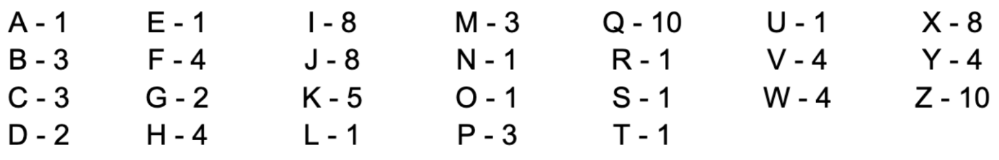

# Instructions  

Below is the coding task for the Unit 6 Test.

  ## Question 3: Scrabble

In Scrabble®, different letters are assigned different numbers of points:

Write a method computeScore(String word) that returns the score for a word without using any if statements. 

*Hint: find the position of a given letter in the alphabet string "abcde…xyz" by calling indexOf; get the score for that letter from the array of point values, and add to the total.

  

  